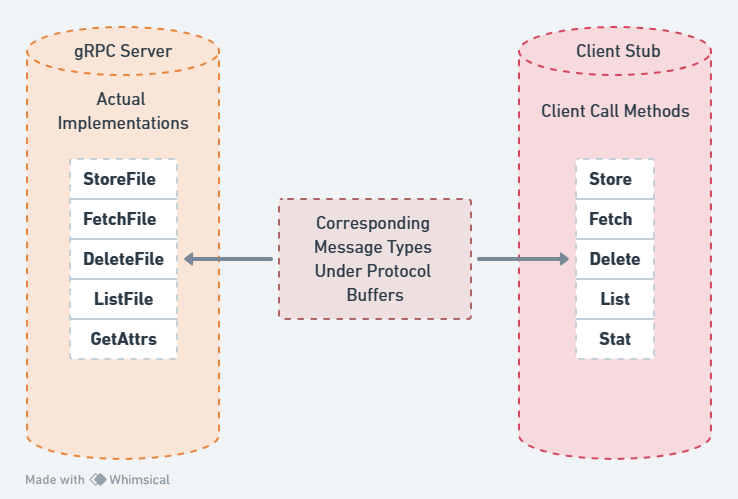

# Distributed File System (DFS)

This project implements a distributed file system (DFS) based on gRPC and Protocol Buffers. The system demonstrates comprehensive skills in distributed systems design, network programming, concurrency, and C++ development.

## Key Features and Technical Highlights

- **Core DFS Operations**: Implementing fetch, store, list, get attributes, and delete operations using gRPC and Protocol Buffers.
- **Client-side Caching**: Entire files are cached client-side to improve performance.
- **Write Lock Mechanism**: Ensures only one client can write to a file at a time, managing concurrent modifications.
- **Asynchronous Notifications**: Utilizes gRPC async calls to propagate file updates efficiently.
- **File Change Detection**: Uses CRC checksums and a "last write wins" strategy for conflict resolution.
- **Multi-threaded Design**: Handles concurrent operations and file system events.
- **Concurrency**: Multi-threaded programming using POSIX threads (pthread) API with synchronization via mutexes and condition variables.
- **Error Handling**: Implements server timeouts and manages various error conditions gracefully.

## System Architecture

- **Client Component**: Manages user requests, local cache, and monitors local file changes.
- **Server Component**: Responds to client requests, maintains file storage, manages file locks, broadcasts file changes.
- **Asynchronous Notification System**: Allows the server to actively notify clients of file changes.
- **Cache Consistency Protocol**: Ensures eventual consistency between client caches and server data.

## Key Learnings

- Deep understanding of distributed systems design principles and trade-offs.
- Practical application of the CAP theorem, balancing consistency, availability, and partition tolerance.
- Mastery of modern RPC frameworks (gRPC) and serialization formats (Protocol Buffers).
- Enhanced system programming skills in Linux environments.
- Improved multi-threading and concurrent programming abilities.
- Learning techniques for maintaining distributed cache consistency.

This project showcases my ability to design and implement complex distributed systems, combining aspects of systems programming, network programming, and concurrent programming.
